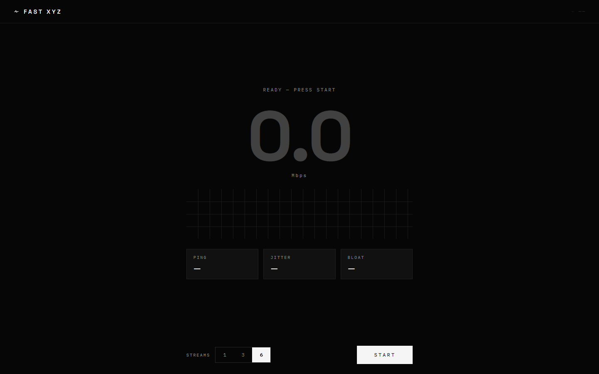

# FAST XYZ

A monochrome internet speed instrument. Single Cloudflare Worker, zero backend
state, **15 KB of JavaScript** (gzipped, everything included).



## Why

fast.com and speed.cloudflare.com are good instruments wrapped in heavy apps.
Fast XYZ keeps the instrument and loses the weight: no login, no database, no
analytics, no framework bloat — just the measurement.

## What it measures

| Metric | Method |
| --- | --- |
| **Downlink** | 1/3/6 parallel streams pulling incompressible 24 MiB blobs, byte-counted via `ReadableStream` |
| **Uplink** | Concurrent 16 MiB random-blob POSTs (everywhere) or `duplex:'half'` request streaming (Chromium), auto-detected |
| **Latency / jitter** | 12 sequential probes, median + mean absolute delta |
| **Bufferbloat** | Probes fired *during* transfer; graded A–F against the idle baseline |
| **Edge PoP** | Reported from `request.cf` — you always know which colo you measured |

The throughput trace is a real oscilloscope record: it scrolls live and freezes
into the final readout. Loaded-latency probe marks are drawn along the bottom
edge, brightness scaled by queueing penalty.

## Engineering notes

- **One deployable unit.** Static assets + API routes in a single Cloudflare
  Worker (`wrangler.jsonc`). `/api/upload` drains bodies and counts bytes;
  everything else is edge-cached static files.
- **Stop-early sampling.** Transfers end when the coefficient of variation
  settles (< 0.06 across consecutive 3 s windows) — typically 6–9 s, not a
  fixed 30 s burn. Final score is a trimmed mean over the stable window.
- **No re-render storms.** React state changes only on phase transitions; the
  100 ms tick feeds canvases and DOM refs directly.
- **Share links without a server.** Results are base64url-encoded into the URL
  hash. History (last 20 runs) lives in `localStorage`.
- **Preact** via `@preact/preset-vite` — React 19's react-dom alone would have
  tripled the bundle.

## Deploys

Push to `main` → Cloudflare Workers Builds builds and deploys automatically.
Live at **https://fast.temidayoxyz.workers.dev**.

## Develop

```bash
npm install
npm run blobs      # generate 6 × 24 MiB random-byte test blobs (gitignored)
npm run preview    # build + wrangler dev → http://localhost:8787
npm run check      # typecheck app + worker
npm run deploy     # build + deploy to Cloudflare (free plan is enough)
```

Keyboard: `Space` starts/aborts, `Esc` aborts. Click the unit label to toggle
Mbps / MB/s.

## License

[MIT](LICENSE)
